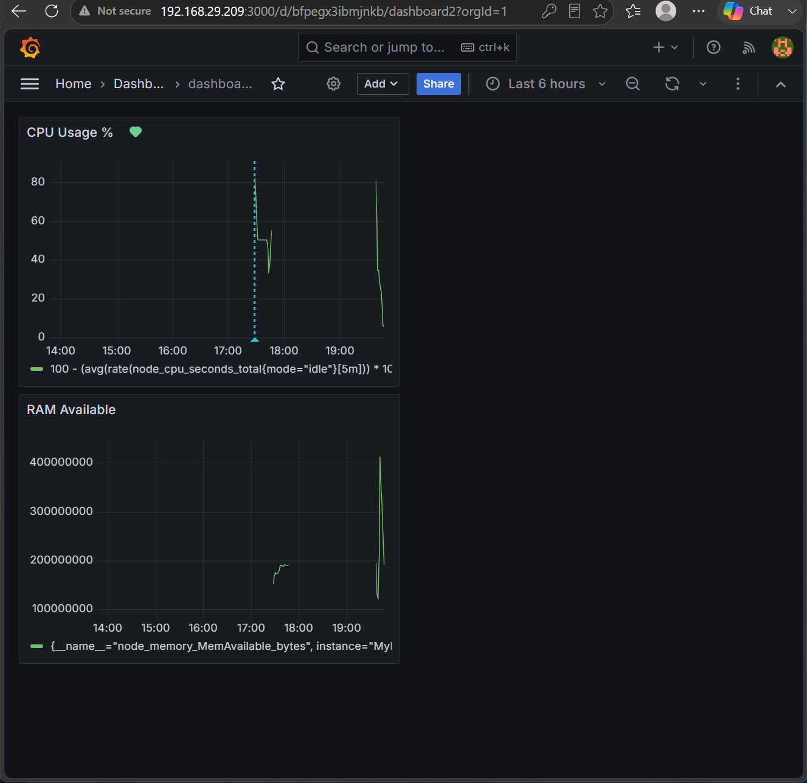
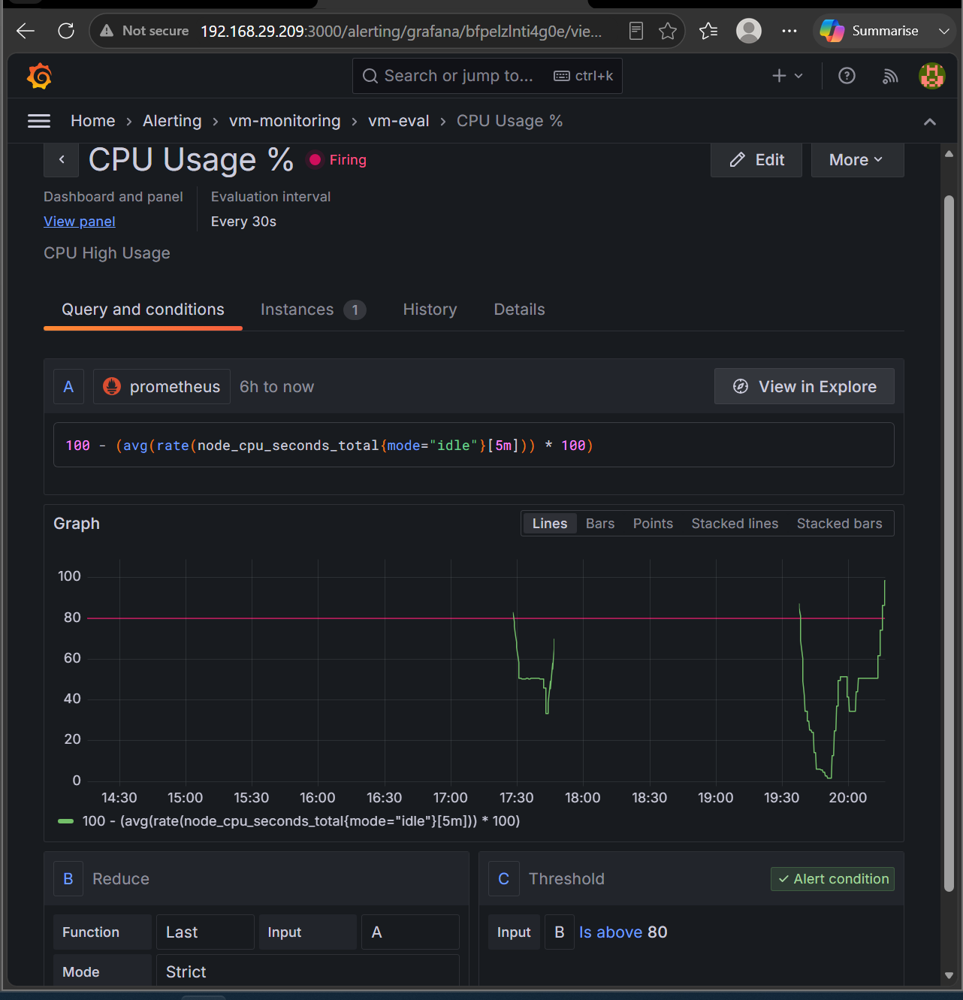

# Linux Monitoring Stack — Prometheus + Grafana Alloy + Grafana


A full host-monitoring stack built **from raw binaries** (no Docker, no package manager
shortcuts) on a CentOS Stream 9 VM, following the Filesystem Hierarchy Standard (FHS).
Every component runs as a dedicated, unprivileged system user managed by its own
`systemd` unit. Metrics flow from the host into Prometheus and are visualised and alerted
on in Grafana.

This was built as a hands-on RHCSA-adjacent project, so the emphasis is on understanding
*why* each piece is configured the way it is — SELinux contexts, service hardening, time
synchronisation, and the metrics pipeline — not just getting it running.

---

## Architecture

```
            ┌──────────────────────────────────────────────┐
            │                CentOS Stream 9 VM             │
            │                                                │
            │   ┌────────────┐   remote_write   ┌─────────┐ │
            │   │   Alloy    │ ───────────────▶ │Prometheus│ │
            │   │ (collector)│  /api/v1/write   │  (TSDB) │ │
            │   │ node metrics│                  └────┬────┘ │
            │   │  :12345 UI │                       │ query │
            │   └────────────┘                       ▼       │
            │                                   ┌─────────┐  │
            │                                   │ Grafana │  │
            │                                   │  :3000  │  │
            │                                   │ dashboards│ │
            │                                   │ + alerts │  │
            │                                   └─────────┘  │
            └──────────────────────────────────────────────┘
```

- **Alloy** scrapes the host via its built-in `prometheus.exporter.unix` (node metrics:
  CPU, memory, disk, etc.) and **pushes** them to Prometheus using `remote_write`.
- **Prometheus** stores the time series and serves queries. It runs with the
  remote-write *receiver* enabled so Alloy can push to it.
- **Grafana** queries Prometheus as a data source, renders the dashboard, and evaluates
  the CPU alert rule.

See [`docs/architecture.md`](docs/architecture.md) for the full data-flow walkthrough.

---

## Tech stack

| Component | Role | Port | Runs as | Location |
|-----------|------|------|---------|----------|
| Grafana Alloy | Metrics collector (unix exporter) | `12345` (UI) | `alloy` | `/usr/local/bin/alloy` |
| Prometheus | Time-series database & query engine | `9090` | `prometheus` | `/usr/local/bin/prometheus` |
| Grafana 11.2.0 | Visualisation & alerting | `3000` | `grafana` | `/usr/local/grafana/` |

---

## Features

- **Binary-based, FHS-compliant install** — binaries in `/usr/local/bin`, config in
  `/etc`, state in `/var/lib`, no containers.
- **Hardened services** — each component runs under a dedicated non-login system user
  with its own `systemd` unit and `Restart=on-failure`.
- **Push-based metrics pipeline** — Alloy → Prometheus `remote_write`, demonstrating the
  modern Grafana Agent/Alloy collection model rather than pull-only scraping.
- **Live dashboard** — RAM availability and CPU usage panels driven by PromQL.
- **Working alert** — CPU-high alert that was load-tested and verified firing.
- **Real troubleshooting notes** — SELinux relabelling, clock-drift-induced empty
  queries, Alloy bind address, and Grafana's home-path dependency, all documented.

---

## Repository structure

```
linux-monitoring-stack/
├── README.md
├── LICENSE
├── .gitignore
├── docs/
│   ├── architecture.md       # how data flows through the stack
│   ├── installation.md       # step-by-step build runbook
│   └── troubleshooting.md     # real issues hit and how they were fixed
├── configs/
│   ├── prometheus/prometheus.yml
│   ├── alloy/config.alloy
│   └── grafana/README.md
├── systemd/
│   ├── prometheus.service
│   ├── alloy.service
│   └── grafana.service
├── dashboards/
│   └── dashboard2.json       # Grafana dashboard (RAM + CPU panels)
├── alerts/
│   └── cpu-high-usage.md      # alert rule definition + test method
├── scripts/
│   └── install.sh            # provisions users, dirs, units, firewall
└── screenshots/              # add your Grafana screenshots here
```

---

## Quick start

> Full runbook in [`docs/installation.md`](docs/installation.md). Short version:

```bash
# 1. Download the three binaries (versions of your choice) and place them:
#    prometheus  -> /usr/local/bin/
#    alloy       -> /usr/local/bin/
#    grafana     -> extract full dir to /usr/local/grafana/

# 2. Provision users, directories, permissions, units and firewall:
sudo ./scripts/install.sh

# 3. Drop the configs into place:
sudo cp configs/prometheus/prometheus.yml /etc/prometheus/
sudo cp configs/alloy/config.alloy        /etc/alloy/

# 4. Start everything:
sudo systemctl enable --now prometheus alloy grafana

# 5. Open Grafana at http://<vm-ip>:3000  (default admin/admin),
#    add Prometheus (http://localhost:9090) as a data source,
#    and import dashboards/dashboard2.json
```

---

## Dashboard

The Grafana dashboard (`dashboard2`) has two panels:

| Panel | PromQL |
|-------|--------|
| **RAM Available** | `node_memory_MemAvailable_bytes` |
| **CPU Usage %** | `100 - (avg(rate(node_cpu_seconds_total{mode="idle"}[5m])) * 100)` |

Screenshots:




---

## Alerting

A Grafana managed alert, **CPU High Usage**, fires when CPU usage goes **above 80%**.
It was verified by deliberately spiking the CPU:

```bash
yes > /dev/null &     # pins a core at 100%
# ...CPU climbs to ~85%, alert moves Pending -> Firing...
kill %1               # stop the load
```

Full rule definition in [`alerts/cpu-high-usage.md`](alerts/cpu-high-usage.md).

---

## What this project demonstrates

- Installing and wiring observability tooling **without container abstractions**, so the
  FHS layout, service users, and unit files are all explicit.
- Understanding the **metrics pipeline** end to end: collection (Alloy) → storage
  (Prometheus) → visualisation/alerting (Grafana).
- Diagnosing genuinely tricky Linux issues: **SELinux** denials after moving binaries out
  of `/tmp`, **time-series queries returning nothing** because of RTC clock drift, and
  service bind-address / working-directory pitfalls. See
  [`docs/troubleshooting.md`](docs/troubleshooting.md).

---

## License

MIT — see [LICENSE](LICENSE).
